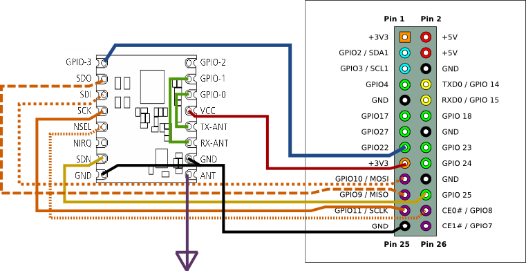

# Driver for the Silicon Labs Si446x wireless transceiver

> **Note**  
> Please see https://github.com/astoeckel/wireless_doorbell for more complete AVR code used to drive the Si446x chip.
> Also note that chip used in conjunction with the code here has always been the `Si4463`, and *not* the `Si443x` series;
> the code in this repository refers to the `443x` for reasons I no longer remember (might have been bad guessing on my side from the
> HopeRF RFM26M manual).

The code in this repository implements a generic driver for the Silicon Labs
Si446x series of wireless transceivers. The code is tailored towards 8-bit
embedded systems such as AVR microcontrollers, however, as of now, only a
backend targeting Linux on a Raspberry Pi is implemented.

Note that the code in its current form is largely untested. The provided main
program switches the transceiver to on-off-keying (OOK) mode triggered by a GPIO
input pin on the Si446x module, making it a drop-in replacement for many cheap
443.92 MHz OOK transmitter modules.

## Usage with a Raspberry Pi

The `main.cpp` provided with this repository brings the transceiver to a
transmit-only state with a frequency of 443.92 MHz. In the test setup, the
Si446x chip is located on a [RFM26W](https://www.pollin.de/p/funkmodul-hoperf-rfm26w-433-mhz-tx-rx-810311)
module, and the carrier is toggled on ond off using the GPIO3 input. This
frequency and mode of operation (OOK) is used by a variety of wirelessly
controlled devices.

The below wiring diagram shows how the RFM26W module should be wired to a
Raspberry Pi if the `main.cpp` program is used.



([Link to PDF version](https://raw.githubusercontent.com/astoeckel/si443x-driver/master/doc/RFM26W_433MHz_Transceiver_RPI.pdf))

In the above diagram, the RFM26W GPIO3 input is connected to GPIO pin 22 on the
Raspberry Pi. The Raspberry Pi is responsible for the generation of the
transmitted binary signal on GPIO pin 22.

## Compilation and installation of the main program

The main program uses the `wiringPi` library for the Raspberry Pi GPIO pins and
the CMake build system. Please install `wiringPi` before continuing,
documentation on how to do this can be found [here](http://wiringpi.com/download-and-install/).

To download, compile, and install the provided example program run
```bash
# Download
git clone https://github.com/astoeckel/si443x-driver

# Build
cd si443x-driver; mkdir build; cd build
cmake ..
make

# Installation
sudo install main /usr/bin/enable_transceiver
sudo install ../enable_transceiver.service /etc/systemd/system
sudo systemctl enable enable_transceiver
sudo systemctl start enable_transceiver
```

## License

```
si446x-driver -- Driver for the Silabs Si446x wireless transceiver IC
Copyright (C) 2015-2017  Andreas Stöckel

This program is free software: you can redistribute it and/or modify
it under the terms of the GNU General Public License as published by
the Free Software Foundation, either version 3 of the License, or
(at your option) any later version.

This program is distributed in the hope that it will be useful,
but WITHOUT ANY WARRANTY; without even the implied warranty of
MERCHANTABILITY or FITNESS FOR A PARTICULAR PURPOSE.  See the
GNU General Public License for more details.

You should have received a copy of the GNU General Public License
along with this program.  If not, see <https://www.gnu.org/licenses/>.
```
